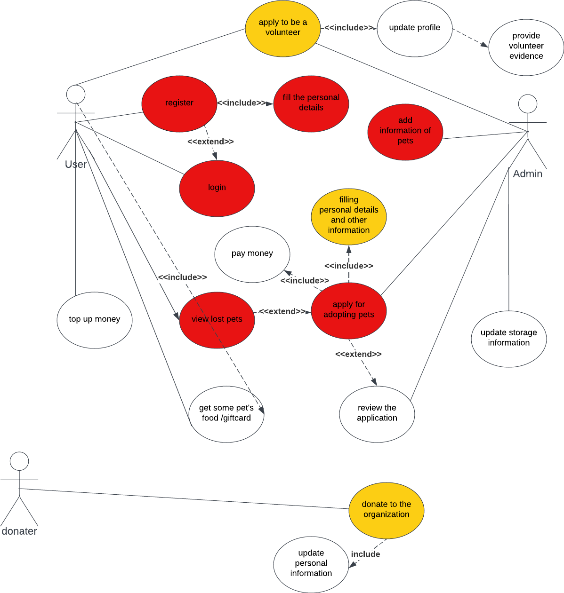
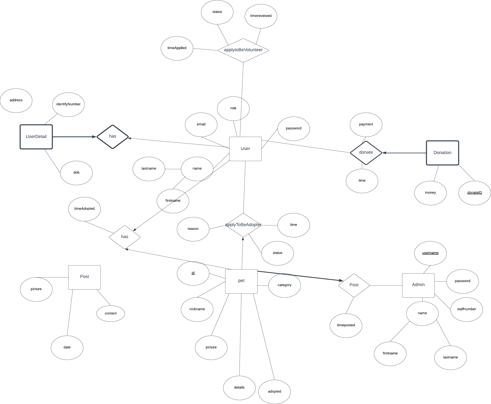
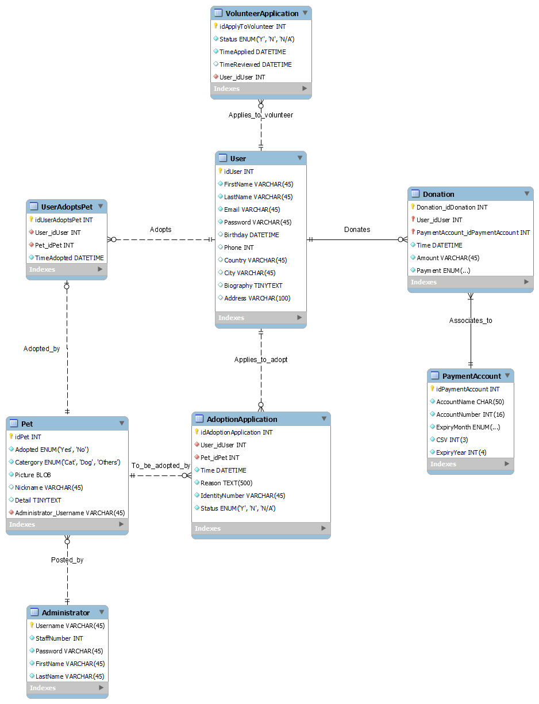
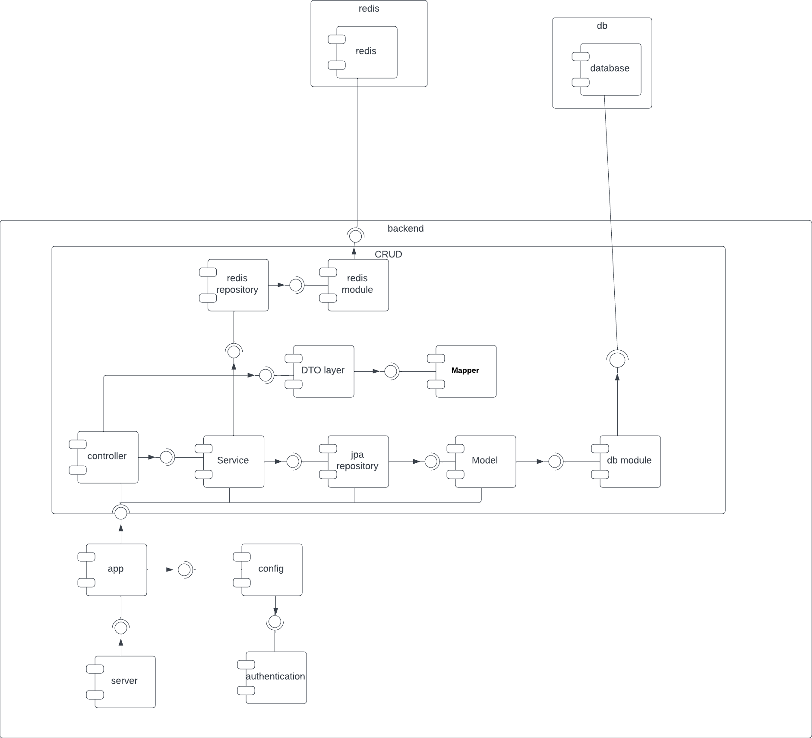

# Pets' home (backend v1.0)
## Introduction
Pet's home is a website available for people to find 
and adopt the lost pets
- People can donate to the website and the website 
can guarantee the transparency of the currency
- People can apply to adopt the pets and the admin can review it 
- People can manage the adopted pet in the website 
- People can apply to become a volunteer
## Tech stack for backend
We used the following technology for the development of our backend

- Java Spring boot(eg. Hibernete, Spring data JPA)
- Java Spring Security
- Swagger
- Redis
- MySQL
- docker
- AWS EC2,S3, code commit
## Use case

## Database design
### Conceptual design

### physical design

## Architecture

https://www.cnblogs.com/masonlee/p/12004638.html
https://pentacent.medium.com/nginx-and-lets-encrypt-with-docker-in-less-than-5-minutes-b4b8a60d3a71
